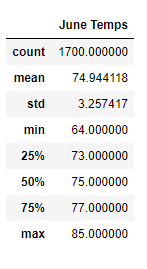

# surfs_up
This repository was created as part of a 6 month Data Analystics Bootcamp administed by George Washington University. This is the repository for the Module 8 Challenge. This challenge involved creating a Flask app to show off weather data we had gathered. New topics covered included SQLite, SQLAlchemy, and Flask. Final project work is in SurfsUp_Challenge.ipynb and app.py. 

9/22/2022: I made a small change to the app to fix an issue that prevented you from returning home and choosing a different app route in the session. 

In the future I might return to this to practice Flask further and add buttons to let you navigate between the different routes in the app. 

## Overview of the Statistical Analysis
### Overview
The purpose of this analysis is to review weather data and create a case for opening a surf shop that also sells ice cream. With this analysis, we will demonstrate that there are enough warm days during the year to ensure steady traffic to this shop. Our primary investor has had previous ventures in the surfing industry fail due to inclement weather. We will specifically be looking at a dataset for the island of Oahu, but the code was designed to be easily adapted to other islands as well.

### Methodology
To analyze the data, we will be using Python, SQLLite, and Flask. Python will be used to write the code to manipulate the data. SQLLite will be used to create a database we can query for information. And Flask will be used to visualize the analysis, so that any investors in the project do not have to go and run the Python script themselves. 

## Results
### Key Points from June and December Temperature Data
* There is not a huge difference in the average temperature between June and December. June's average temperature is 74.9 degrees. In December it is slightly cooler at 71.0. Even if your average day in December is almost 5 degrees colder than June, it is still warm most days. 

* There can by chilly days in December (by Hawaiian standards). The lowest temperature recorded in December was 56 degrees. On colder days, the shop will probably not sell a lot of ice cream. But this is still fine weather for surfing since wetsuits allow you to surf even when it is chilly out. 

* There can also be very warm days in December. The highest temperature recorded was 83 degrees, which is two degrees colder than the warmest June day in the dataset. So, there can also be outlier days where we might see an unexpected bump in customers looking for ice cream. 

## Summary
### High Level Summary
Based on the temperature data, we can conclude that the temperature on Oahu is consistent enough to warrant selling surfing gear and ice cream year-round. In my experience, surfing is possible year-round with the right equipment. Colder days are less likely to impact this side of the business, and the coldest day in our dataset was still a relatively warm 56 degrees. 

For the ice cream, the temperature is slightly cooler during December. This might depress sales, but only to a small degree. The average temperature in December is only about 5 degrees cooler, meaning there should still be plenty of days people are looking to purchase ice cream. 

### Additional Queries
To further the analysis, there are several additional queries we could run. 
1. We could query the average number of days in December that fall below 70 degrees. Only 25% of the recorded temperatures fall below 73 degrees. If there are enough days below 70, we could offer a special on ice cream that day to entice customers who might be less inclined to buy on a chilly day. 

2. We could try to pinpoint the best location on the island for our store. There are different stations throughout the island, and maybe there is a side of the island that has slightly warmer days. This would require additional data to perform, we would need a way to match the 9 stations with a physical location on the island. For example, if one station has warmer weather, but is on a mountain, then we would not want to build our shop there.
